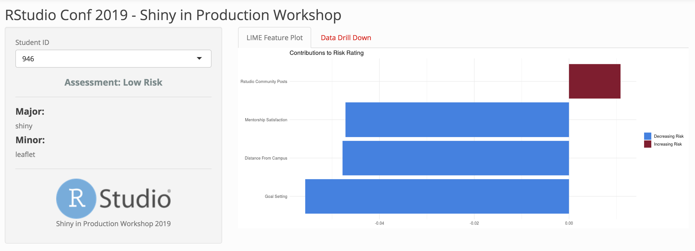

# Introduction to the Application {#app-intro}

**Every Application has an Origin Story**

Data Scientists at RStudio University have discovered that there are trackable traits and behaviors students engage in that have been predictive of the desired 4-year graduation track.

They have built a shiny application that can be used by the very data-savvy advisors at this illustrious institution to identify students in need of guidance and show them the top behavioral factors driving individual predictions coming out of the model.

The POC was a smashing success - but now _our advisors actually want to use this thing for real_.

- We've developed a nice app
- We want to put it into production
- We want confidence that it will perform well in production, both now and in the future

## Activity: Explore the Application

_First: Open `app.R` and Run the Application_

**Discussion: Explore the Application** 

- Are there any parts of the app code that don’t make sense?
- Is this application ready for production?
- How would you define "production"?
- What insights would be useful to have about the application before we try to deploy it?

_Additional Discussion:_

- What is your current process for taking applications into production?

**Deliverable: Start a Plan**

- Create a checklist
- Outline the steps you might take to put this application into production 

**Checklist for Taking Applications into Production**

A high-level Checklist to build off of:

