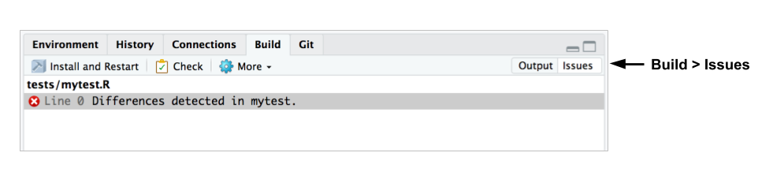

# Application Testing: `shinytest`

- You've developed a nice app
- You've put it in production
- You want to be confident that it will keep running in the future

**Things that can change/break a Shiny application**

- Modifying code
- Upgrading the `shiny` package
- Upgrading other packages
- Upgrading R
- External data source changes or fails

#### Testing Options

- Manual testing
  - time intensive
  - inconsistent
  
- Automated testing (hard)
  - web browser
  - simulated user interactions
  - tests for graphical elements

Enter: Snapshot-based testing [Webinar Slide Deck](https://github.com/rstudio/webinars/blob/master/48-shinytest/shinytest.pdf)


- Can be easier to create tests
- Can test an entire application
- More sensitive to spurious changes

#### Automated Testing for Shiny Apps

- [Blog](https://resources.rstudio.com/rstudio-blog/shinytest-automated-testing-for-shiny-apps)

`shinytest` is a package (available on CRAN) to perform automated testing for Shiny apps.

Basic `shinytest` proceedure:


Support for `shinytest` is available in RStudio v1.2 preview.

**Installation** 

`install.packages("shinytest")

**Note:** When running `shinytest` for the first time, you may be prompted by the RStudio IDE or package warning messages to install some dependencies. `shinytest` requires a headless web browser (PhantomJS) to record and run tests.

- To install it, run shinytest::installDependencies()
- If it is installed, make sure the phantomjs executable can be found via the PATH variable. 

**Record Tests**

- Run `recordTest()` to launch the app in a test recorder. 
- Create the tests by interacting with the application - this will allow the recorder to snapshot the application state at various points.
- Quit the test recorder. This action will trigger the following events:
  - The test script will be saved as a .R file in a subdirectory of the application named `tests/`.
  - If you are running in the RStudio IDE, it will automatically open this file in the editor.
  - The test script will be run, and the snapshots will be saved in a subdirectory of the `tests/` directory.
  
To record tests from `R`, run the following:

```
library(shinytest)

recordTest("path/to/the/app")   #Replace with the correct path
```

To record tests from RStudio v1.2, when an application file (app.R, server.R, ui.R or global.R) is open in the editor, a button labeled _Run App_ will appear at the top of the editor pane. Click on the small black triangle next to this button to reveal the menu of extended options. 


This launches the Shiny application to be tested in a separate R process. We'll refer to this as the **target app**. At the same time, the current R process lauches a special Shiny application which displays the target app in an iframe along with some controls. We'll refer to this as the **recorder app**. You should see something like this:


The panel on the right displays some controls for the test recorder, as well as a list of **recorded events**. As you interact with the target app, you will see those interactions appear in the recorded events list.

For testing a Shiny application, interacting with the inputs is only one part of the equation. It's also necessary to check that the application produces the correct outputs. This is accomplished by taking **snapshots** of the application's state.

To take a snapshot of the application's state, click the _Take snapshot_ button on the recorder app. This will record all input values, output values, and exported values.

**Running Tests**

When you quit the test recorder, it will automatically run the test script. There are three separate components involved in running tests:

1. First is the **test driver**. This is the R process that coordiates the testing and controls the web browser. When working on creating tests interactively, this is the R process that you use.
2. Next is the **Shiny process**, also known as the **server**. This is the R process that runs the target Shiny application.
3. Finally, there is the **web browser**, also known as the **client**, which connects to the server. This is a headless web browser - one which renders the web page internally, but doesn't display the content to the screen (PhantomJS). 

So, when you exit the test recorder, it will by default automatically run the test script and print something like this:

```
Saved test code to /path/to/app/tests/mytest.R
Running mytest.R 
====== Comparing mytest ...
  No existing snapshots at mytest-expected/. This is a first run of tests.

Updating baseline snapshot at tests/mytest-expected
Renaming tests/mytest-current
      => tests/mytest-expected.
```

This is the result of running `testApp()`, which can also be manually run by providing the desired application and test like this: 

`testApp("exampleApp", "mytest")`

The built-in integreation with RStudio v1.2 provides `Run Tests` as a drop down menu option in your Shiny app source file (see it located under the _Record Test_ option in the screenshot above).

**Subsequent Test Runs**

After the initial test run, you can continue to run the tests to check for changes in application behavior.

If there are any differences between current and expected results, the test output will look something like this:

```
Running mytest.R 
====== Comparing mytest ...
  Differences detected between mytest-current/ and mytest-expected/:

    Name         Status      
    001.json  != Files differ
    001.png   != Files differ
Would you like to view the differences between expected and current results [y/n]? 
```

To view failed tests in the RStudio IDE, go to the _Build tab_ and make sure the _issues toggle_ is selected:



For each test with different results, you can see the differences between the expected and current results.

**Testing Code**

The `shinytest` package was created for testing Shiny applications on the interaction-level. To test Shiny code and functions, we suggest using the `testthat` package. 

[Info](http://testthat.r-lib.org/)
[GitHub](https://github.com/r-lib/testthat)

Learn about testing and how to setup test workflow and structure: [R packages by Hadley Wickham](http://r-pkgs.had.co.nz/tests.html)

####

