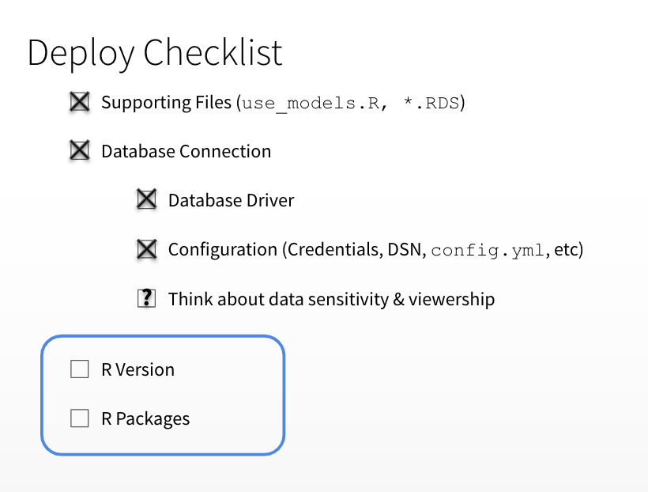

# Connecting to Data in Production

- Key Resource: [db.rstudio.com](db.rstudio.com)

## The `config` package

## Environment Variables

When developing content for RStudio Connect, you should never place secrets (keys, tokens, passwords, etc.)
in the code itself. Best practices dictate that this kind of sensitive information should be protected through
the use of environment variables or another method of configuration such as the config package.

The Vars panel makes it easy to define environment variables which are then exposed to the processes
executing your content. Note that there is no way to define environment variables prior to publishing content.
If your content code relies on environment variables, publish it in an initial ‘broken’ state, then add the
environment variables through this pane before sharing or testing the content.

Click on the Add Environment Variable button, then provide a name and value for your environment
variable. For security reasons, once you add a variable, the value will be obscured and cannot be edited. You
can always delete a variable and create a new one with the same name.

## Activity: Databases

**First: Read [This](https://db.rstudio.com/best-practices/portable-code/)!**

**Discussion:** 

_Data Management_

- How does your organization connect to data?
- What data are we exposing to viewers? Is it appropriate for all viewers?
- What else could we manage with the `config` package? 

**Deliverable: Running, Deployed App**

- Update config.yml and Redeploy
- Edit the Environment Variables in RStudio Connect

---

**Revisit the Deployment Checklist**

