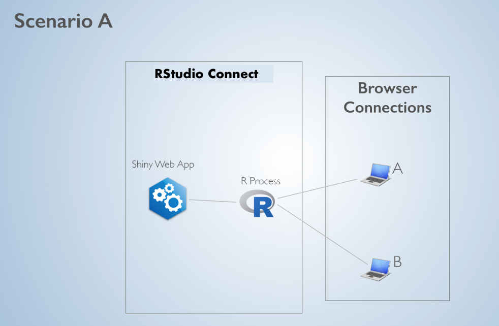
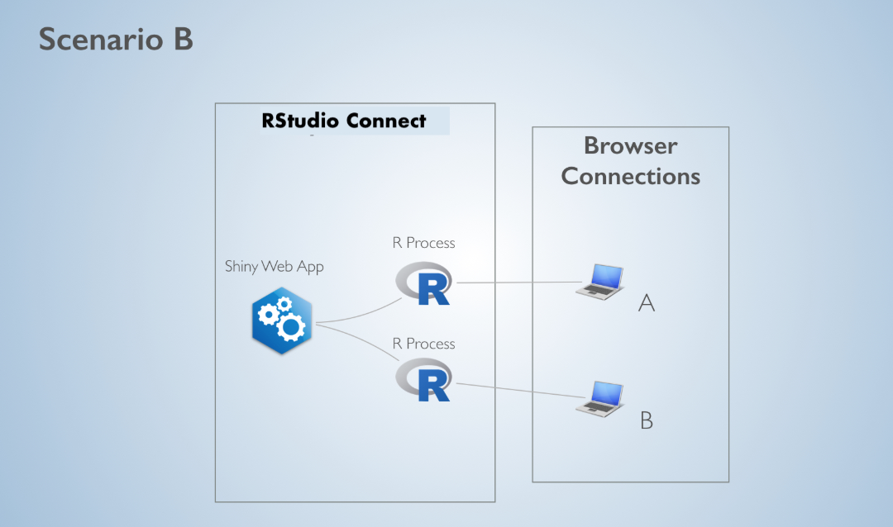
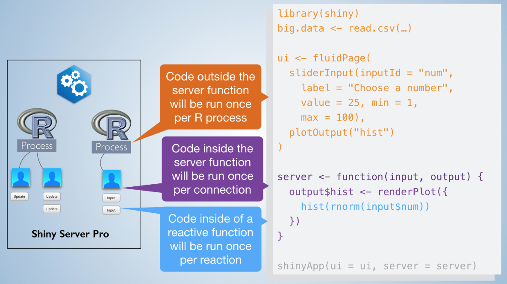

# Scaling 

## Application Scaling 101

- cooking/ kitchen metaphor

## RStudio Connect Performance Settings

**Scaling and Performance Tuning in RStudio Connect**

- [Article Reference](https://support.rstudio.com/hc/en-us/articles/231874748-scaling-and-performance-tuning-rstudio-connect)

RStudio Connect is built to scale content. Publishers and administrators have access to runtime settings to help tune and scale their applications and APIs. The primary concern for scaling content in RStudio Connect is understanding when and how R code will be executed on the server.

Content published on RStudio Connect can broadly fall into two categories:

1. Static / Batch Content

Static content is content a user can visit without requiring a running process. Examples include PDF documents, plots, and HTML files. HTML files can include interactive elements where the interactivity occurs on the client. RStudio Connect is able to update static content on a schedule.

2. Interactive Content

A powerful component of RStudio Connect is the ability to host data products that require backend processes during a user's visit. Examples include shiny applications and R Markdown documents with runtime::shiny, plumber APIs, and TensorFlow APIs. In the case of Shiny, an end user's browser (the client) is connected with an R process running on the server. When a user changes an input, the client sends a message to the server and a portion of R code is re-run. The server sends back the result as output. In the case of APIs, a client makes a request which is sent to a running process, and the results are sent back to the client.

For Interactive Content, RStudio Connect enables scaling through parameters that determine the content's [scheduler](https://docs.rstudio.com/connect/admin/appendix-configuration.html#appendix-configuration-scheduler).

### Content Scheduler

When a user requests content with Shiny components, RStudio Connect opens a channel between the user and an R process. Now, suppose a second user requests the same content. There are two potential scenarios:

In Scenario A, both users are linked to the same R process. Because R is single-threaded, if user A and user B both change an input and trigger R calculations, their requests will be handled sequentially. (User B will have to wait for user A’s calculation to complete, and then for their own calculation to complete before they will see an updated output).

In Scenario B, Connect will link each user to their own R process. If user A and user B both change an input, their calculations will happen simultaneously. 

Why wouldn’t RStudio Connect always select Scenario B? The answer has to do with memory and initial load time. When 2 users are connected to the same R process, they get to share everything that is loaded outside of the server function.

To see this, consider when the different pieces of Shiny application code are executed:

This works because Shiny makes use of R’s unique scoping rules (read more [here](http://shiny.rstudio.com/articles/scoping.html)). In Scenario B, all of the shiny code has to be re-run, including loading any globally available data. This means the memory usage is 2x what it would be in Scenario A. Additionally, spinning up an R process and executing all of the shiny code takes time. While the application is more responsive to both users after the web page is loaded, it will take longer for them to connect initially.

The scheduling parameters tell RStudio Connect to act somewhere in between Scenario A and Scenario B, to maximize the trade-off between app responsiveness and memory consumption/load time. The parameters also specify how long R processes and user connections should remain idle before timing out.

### Scheduling Parameters

**Max processes** - Determines the maximum number of processes that will be created. Max processes x Max connections per process = total number of concurrent connections. Default value is 3.

_Pick a value that will support the expected number of concurrent users or requests._

**Min processes** - Determines the minimum number of processes that will always be running. For Shiny applications and plumber APIs, user requests only execute specific functions. R code outside of those functions can be run when the process starts before user requests are made, which can dramatically speed up response time.

_Pick a number close to Max processes if your application or API pre-loads a large amount of data to be shared by every user. Pick a small number to minimize the amount of memory consumed._

**Max connections per process** - The maximum number of connections per process. Default value is 20.

_Pick a small number if your content involves heavy computation. Pick a larger number if your content shares data between users. (e.g. Pick a large number if your content takes a long time to load, but after loading is very fast.)_

**Load factor** - Determines how aggressively new processes will be created.  A value close to 0 means new processes will be spun up aggressively to try and keep the number of connections per process small. A value close to 1 means the number of connections per process will be close to max connections. Default value is 0.5.

_Pick a small number if your content loads quickly but involves expensive computation. Pick a number closer to 1 if your content loads slowly, but after loading is fast OR if you want to minimize the amount of memory._

### High Availability and Horizontal Scaling

Other considerations for widely accessed content are high availability and horizontal scaling. Both require content to be hosted by more than one server. RStudio Connect supports a [cluster setup](https://docs.rstudio.com/connect/admin/high-availability.html).

### R Markdown Documents with runtime::shiny

R Markdown documents are a bit different. In essence, an Rmd with runtime::shiny specified places everything (data loading, UI creation, etc) inside of the server function. The implication is an Rmd with runtime::shiny will always consume more memory as users connect.

[Prerendered Shiny Documents](https://rmarkdown.rstudio.com/authoring_shiny_prerendered.html) alleviate this problem.
