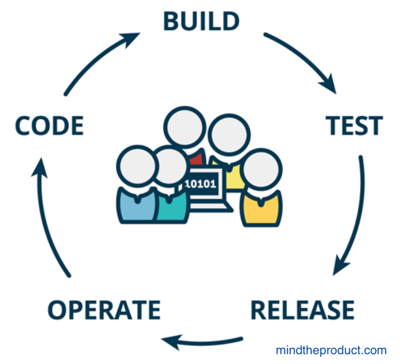

# DevOps Philosophy & Tooling

DevOps is a self-help philosophy for IT and software development teams that work together. It seeks to address a core problem: **The Fear of Taking Code into Production**

Software development and deployment often involves a separation of labor often referred to as a code deployment handoff. Managing handoffs can be painful and risky business when handled without care:


- Deployments/releases are high-risk events
- It takes a long time to deliver new features to customers
- There is no visibility into how code is deployed into production, therefore it is impossible to know what to optimize or fix in the system and/or people who seek to improve portions of workflow are likely not addressing true bottlenecks.
- Dev and Ops have seemingly conflicting goals and objectives

The Fix (ref: [The DevOps Handbook](https://www.amazon.com/dp/1942788002/ref=cm_sw_r_tw_dp_U_x_bUwpCbBTAM8HQ)) "The principles underpinning DevOps": 

1. Accelerate the delivery of work from Development to Operations to customers
2. Commit to evolving ever safer systems of work through feedback
3. Promote a high-trust culture and embrace continual learning and experimentation (risk-taking) in daily work



> Even more important than daily work is the improvement of daily work  --Mike Orzen, Lean IT

## Integrating Data Science and DevOps

### How does data science fit in with the DevOps philosophy?

It's not _your job_ to understand operations and systems administration. And it's not IT's job to understand R programming and shiny app development. But it takes shared goals and a little empathy from both sides to get less painful results.

We can leverage (steal) the DevOps philosophy and apply it to manage code deployment handoffs between data science and IT.


### What do your dev, test and production environments look like?

- Do developers have access to production-like environments on their own workstations?
- Can these evnvironments be assembled on-demand?
  - Version Control
  - Infrastructure as Code

1. In what ways can analytic infrastructure for R change between development and production environments?
2. What processes or tools could help solve these issues?
3. Should development inform how a production environment is built, or should production inform how an application is developed?

### Does code deployment feel like a high-risk operation?

Having developers focus on automating and optimizing the deployment process can lead to significant improvements in deployment flow.

- Smoke testing
- Build validation tools
- Environment consistency

_Relate your Shiny deployment checklist to the pipeline an IT group might consider. Where is there risk? How can it be reduced?_

Sample Ideas from [The DevOps Handbook](https://www.amazon.com/dp/1942788002/ref=cm_sw_r_tw_dp_U_x_bUwpCbBTAM8HQ):

- Packaging code in ways suitable for deployment
- Creating pre-configured virtual machine images or containers
- Automating the deployment and configuration of middleware
- Copying packages or files onto production servers
- Restarting server, applications or services
- Generating configuration files from templates
- Running automated smoke tests to make sure the system is working and correctly configured
- Running testing procedures
- Scripting and automating database migrations

### Can deployments be decoupled from releases?

- **Deployment** is any push of code to an environment (test, prod)
- **Release** is when that code (feature) is made available to users or customers

Deployment on demand and thoughtful release strategies allow more control (and more success) over the delivery of features to end users.

Environment-based Release Patterns:

- Blue-Green Deployment Pattern
- Canary and Cluster Immune System

Application-based Release Patterns:

- Feature Toggles
- Dark Launches

_Which of these release patterns is most well-suited for Shiny Application development and deployment with the RStudio Connect publishing platform?_ 

**One Possibility: Feature Toggles (Dark Launch)**

Shiny applications can access the username and groups of the current user through the session parameter of the shinyServer function.

Groups meta-data is populated when using password, or OAuth authentication. It is not populated with LDAP, PAM, or proxy authentication.

```
shinyServer(function(input, output, session) {
  output$username <- reactive({
    session$user
  })
  
  output$groups <- reactive({
    session$groups
  })
})
```

Your application could use this information to display customized messages or to enable functionality for a specific subset of users.


