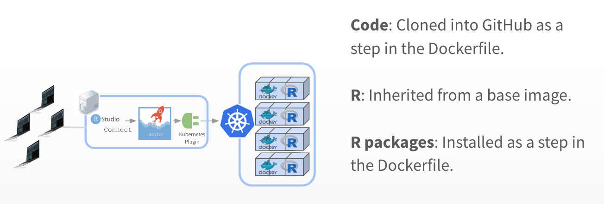

# Production Case Studies

_Workshop Exercise: Case Study Discussions_

**First: Pick one case study**

**Discuss:**

- What tools does your admin team use?
- How would you explain the goals of a shiny app to DevOps?

**Deliverable:**

- Whiteboard (in a medium of your choice) what an architecture might look like for your case study.
- Delineate who (and what tool) is responsible for code, R, R packages.

#### Case Study A: Dev/Test/Prod

Before publishing an update to our app, we want to run user acceptance tests.

#### Case Study B: CI, Git, Chef

All of our production code must be deployed from Git.

#### Case Study C: Docker

We scale applications through Docker - how does Shiny fit in?

