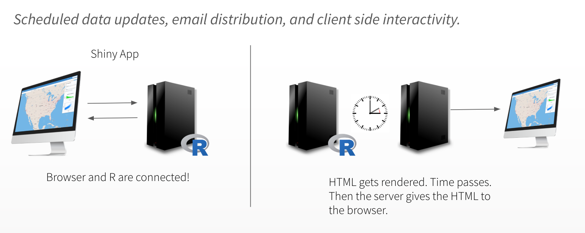
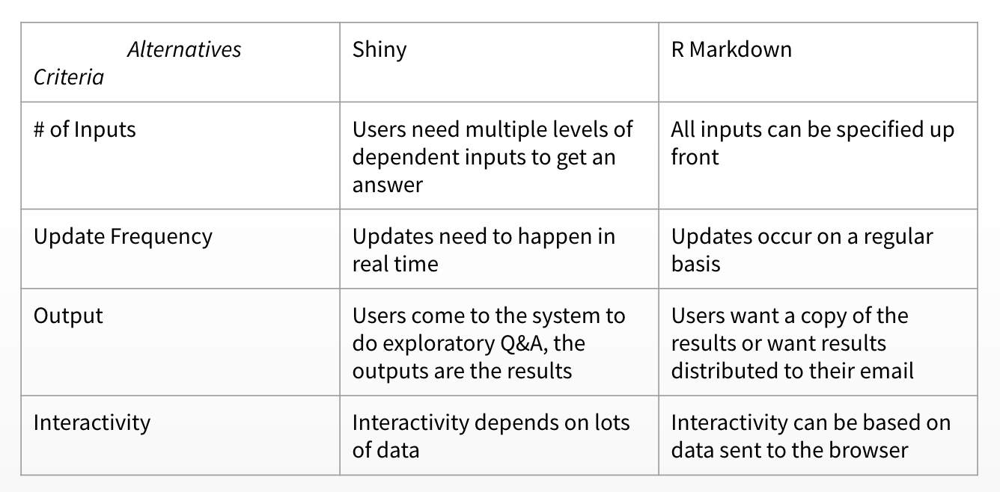

# Alternatives to Shiny

## Plumber

_Could our student "scoring" be hosted outside of the Shiny app?_


### Intro to Plumber

**Resources:**

Plumber is an R package that converts your existing R code to a web API using a handful of special one-line comments.

> What are Web APIs? For some, APIs (Application Programming Interface) are things heard of but seldom seen. However, whether seen or unseen, APIs are part of everyday digital life. In fact, you’ve likely used a web API from within R, even if you didn’t recognize it at the time! Several R packages are simply wrappers around popular web APIs, such as `tidycensus` and `gh`. Web APIs are a framework for sharing information across a network, most commonly through HTTP.

You can install the latest stable version from CRAN using the following command:

```
install.packages("plumber")
```

These comments allow plumber to make your R functions available as API endpoints. You can either prefix the comments with `#*` or `#'` but we recommend the former since `#'` will conflict with the Roxygen package.

Basic example:

1. Create a File: `plumber.R`

```
# plumber.R

#* Echo back the input
#* @param msg The message to echo
#* @get /echo
function(msg=""){
  list(msg = paste0("The message is: '", msg, "'"))
}

#* Plot a histogram
#* @png
#* @get /plot
function(){
  rand <- rnorm(100)
  hist(rand)
}

#* Return the sum of two numbers
#* @param a The first number to add
#* @param b The second number to add
#* @post /sum
function(a, b){
  as.numeric(a) + as.numeric(b)
}
```

2. Serve the `plumber.R` file from the R console:

```
library(plumber)
r <- plumb("plumber.R")  # Where 'plumber.R' is the location of the file shown above
r$run(port=8000)
```

You can visit this URL using a browser or a terminal to run your R function and get the results. For instance http://localhost:8000/plot will show you a histogram, and http://localhost:8000/echo?msg=hello will echo back the ‘hello’ message you provided.

3. Hit the endpoints (example: use `curl` from mac/linux terminal)

```
$ curl "http://localhost:8000/echo"
 {"msg":["The message is: ''"]}
 
$ curl "http://localhost:8000/echo?msg=hello"
 {"msg":["The message is: 'hello'"]}
 
$ curl --data "a=4&b=3" "http://localhost:8000/sum"
 [7]
```

**References and Resources:**

- [Reference: Plumber Docs](https://www.rplumber.io/)
- [Plumber Integration in RStudio 1.2](https://blog.rstudio.com/2018/10/23/rstudio-1-2-preview-plumber-integration/)
- [RViews Blog: REST APIs and Plumber by James Blair](https://rviews.rstudio.com/2018/07/23/rest-apis-and-plumber/)
- [Video: Turning your R code into an API by Jeff Allen](https://www.rstudio.com/resources/videos/plumber-turning-your-r-code-into-an-api/)
- [Webinar: Plumbing APIs with Plumber by Jeff Allen](https://www.rstudio.com/resources/videos/plumbing-apis-with-plumber/)

## Activity: Plumber

**First: Try creating your own plumber API in the IDE (New File)**

**Discussion:**

_Consider our new architecture_

Does my R functionality need to be accessed by other systems?

- Why might a RESTful API be easier to scale than a Shiny app?
  - Requests are stateless, so it is easier for R processes to come and go.
- What benefits come from pulling the modeling code out of our app?
  - We can update the model independently of the app, e.g. if we wanted to retrain.

**Deliverable:**

- Add an item to our production checklist to consider plumber. 
- Add 2 decision criteria to the checklist to decide when a plumber API would be useful.

## R Markdown

R Markdown is an open-source R package that turns your analyses into high quality documents, reports, presentations and dashboards. An R Markdown document is written in markdown (an easy-to-write plain text format) and contains chunks of embedded R code. R Markdown documents are fully reproducible and support dozens of output formats including HTML, PDF, and Microsoft Word documents.

R Markdown files are designed to be used with the `rmarkdown` package. `rmarkdown` comes installed with the RStudio IDE, but you can acquire your own copy of `rmarkdown` from CRAN with the command: 

```
install.packages("rmarkdown")
```

R Markdown reports rely on three frameworks:

1. `markdown` for formatted text
2. `knitr` for embedded R code
3. `YAML` for render parameters

To create an R Markdown report, open a plain text file and save it with the extension .Rmd. You can open a plain text file in your scripts editor by clicking File > New File > Text File in the RStudio toolbar.



**Publishing R Markdown to RStudio Connect**

- **Publishing Destination**

When publishing documents to RStudio Connect, you may encounter other deployment options depending on your content.

  - RPubs documents are (1) always public, (2) always self-contained, and (3) and cannot contain any Shiny content.
  - Choose "RStudio Connect" to publish to your RStudio Connect server.

- **Publish Source Code**

Publishing the document with source code means that your R Markdown file (.Rmd) will be deployed to RStudio Connect. This file is rendered (usually to HTML) on the server.

Publishing only the finished document means that the HTML file you rendered locally is deployed to RStudio Connect.

We recommend publishing your documents with source code, as it allows you to re-render the document with RStudio Connect (on a weekly schedule, for example). If the document cannot be rendered by RStudio Connect because of files or data sources that are unavailable on the server, choose “Publish finished document only” so others can view your work.

- **Document Selection**

It is possible to link together multiple R Markdown documents to make a multi-page document, so this is your chance to indicate that you’ve done this, and to publish all the documents at once. In most cases however you’ll want to publish just the current document.

- [RStudio Connect Publishing Guide](https://docs.rstudio.com/connect/user/publishing.html#publishing-documents)

- [R Markdown](https://rmarkdown.rstudio.com/)


**References and Resources:**

- [R Markdown in the RStudio Connect User Guide](https://docs.rstudio.com/connect/user/r-markdown.html)
- [R Markdown Reference Articles](https://rmarkdown.rstudio.com/articles.html)
- [RViews Blog: Communicating results with R Markdown by Nathan Stephens](https://rviews.rstudio.com/2018/11/01/r-markdown-a-better-approach/)
- [RViews Blog: Enterprise Dashboards with R Markdown by Nathan Stephens](https://rviews.rstudio.com/2018/05/16/replacing-excel-reports-with-r-markdown-and-shiny/)

## Activity: R Markdown

**First: Create your own R markdown document (New File)**

**Discussion:** 

_Consider R Markdown_

- How does an R Markdown document scale?
- What types of interactivity can be added to R Markdown?

**Deliverable:** 

- Create a decision matrix comparing Shiny to R Markdown


